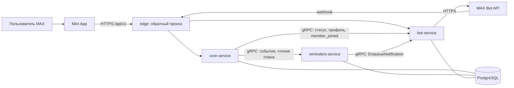

# Архитектурное и техническое задание «Вовремя» 2.0.0

Дата: 20.09.2026. Заменяет версию 1.0.0 в части архитектуры backend.
Разделы, не затронутые переходом на три сервиса, сохраняют действие и указаны ссылками.

## 1. Краткое описание продукта

Мини-приложение MAX для контроля сроков документов малого бизнеса. Пользователь ведёт реестр
документов организации, получает подсказку по типовым документам своего профиля и заранее
получает напоминания в чате бота. Пилотный сегмент — общепит Санкт-Петербурга на 1–3 точки.
Роли: owner, editor, viewer. Подробности предметной области — `docs/requirements/product-brief.md`.

## 2. Реестр изученных материалов

Полный реестр с размерами, хешами и способом изучения — `docs/implementation/input-audit.md`
и машиночитаемый `docs/implementation/input-manifest.json`. Кратко: шесть архивов проекта
(91 уникальный файл, содержимое совпадает между архивами), исходное ТЗ трека в PDF (22 страницы),
контрольные суммы. Недоступных и повреждённых материалов не обнаружено.

## 3. Глоссарий

Действует `docs/requirements/glossary.md`. Добавлены термины:

| Термин | Значение |
|---|---|
| Проекция | локальная копия данных другого сервиса, обновляемая событиями; источник истины остаётся у владельца |
| Outbox | таблица исходящих событий, заполняемая в транзакции изменения |
| Inbox | журнал принятых событий получателя, обеспечивающий идемпотентность |
| Версия агрегата | монотонное число, определяющее порядок применения событий одного агрегата |
| Durable acceptance | гарантия, что принятая операция сохранена и будет доставлена |
| reminders_state | состояние актуальности плана напоминаний в ответе публичного API |

## 4. Реестр требований

Действует `docs/requirements/requirements-registry.md`. Продуктовые требования не изменялись.
Изменилось распределение владельцев:

| Группа требований | Владелец 1.0.0 | Владелец 2.0.0 |
|---|---|---|
| Реестр документов, периоды, статусы | core | core |
| Подбор типовых документов | core | core |
| План напоминаний, расписание | core | reminders |
| Доставка сообщений MAX | bot | bot |
| Отображение ближайшего напоминания | core | core (данные из reminders) |

## 5. Матрица трассируемости

Действует `docs/requirements/traceability-matrix.md` с дополнением: требования напоминаний
(FR-14…FR-18 в части плана) ведут на `docs/handoffs/reminders-service.md` §14 и тесты RS-01…RS-25.

## 6. Противоречия и допущения

| Источник | Противоречие | Разрешение |
|---|---|---|
| AC-05 и распределённая архитектура | «напоминание пересчитано» подразумевало немедленность | сохранена семантика в обычном режиме через синхронную попытку доставки (300 мс); при отказе ответ помечается как незавершённый пересчёт; предел 60 с (ADR-020) |
| OpenAPI и правила идемпотентности | два описания поведения при повторе создания | принято правило «тот же идентификатор от того же автора в той же организации возвращает текущее состояние» |
| ADR-005 и конфигурация сети | изоляция gRPC декларировалась, но не обеспечивалась | адрес прослушивания ограничен внутренней сетью (ADR-029) |
| ADR-014 и среда сборки | sqlc требует кодогенератора | для reminders-service SQL написан вручную поверх pgx с параметрами; правило зафиксировано в задании сервиса |

Допущения: PostgreSQL 18 в целевой среде (реализация проверена на 16, несовместимых конструкций не используется);
один экземпляр каждого сервиса на пилоте; лимиты MAX API соответствуют документации платформы.

## 7. Выбор новой архитектуры

Вариант C: три backend-микросервиса. Обоснование, отвергнутые варианты и последствия — ADR-017.

## 8. Решения ADR

Актуальный перечень и статусы прежних решений — `docs/adr/README.md`.
Новые решения: ADR-017…ADR-031.

## 9. Общая архитектура

Схемы `core`, `reminders`, `bot` в одном экземпляре PostgreSQL с раздельными ролями.
Межсервисный трафик — только внутренняя сеть (ADR-029).

## 10. core-service

Задание на изменения — `docs/handoffs/core-service-v2.md`; действующая часть v1.0.0 — `docs/handoffs/core-service.md`.
Модули: identity, catalog, workspace, documents, exports, audit, telemetry, outbox.

## 11. reminders-service

Полное задание и фактическое состояние реализации — `docs/handoffs/reminders-service.md`.
Реализован в рамках текущего этапа.

## 12. bot-service

Задание на изменения — `docs/handoffs/bot-service-v2.md`; действующая часть v1.0.0 — `docs/handoffs/bot-service.md`.

## 13. Frontend и интеграция с MAX

Действуют `docs/frontend/frontend-architecture.md` и `docs/max/max-integration-spec.md`.
Изменение одно: экран реестра и карточка документа обрабатывают `reminders_state`
и отсутствие `next_reminder_at` (состояния «пересчёт выполняется» и «данные плана недоступны»).
Стек frontend не меняется.

## 14. Межсервисные контракты

| Контракт | Файл | Направление | Версия |
|---|---|---|---|
| IngestService | api/proto/vovremya/reminders/v1/ingest.proto | core → reminders | 1.0.0 |
| ReminderQueryService | api/proto/vovremya/reminders/v1/query.proto | core → reminders | 1.0.0 |
| MessagingService | api/proto/vovremya/bot/v1/messaging.proto | core → bot, reminders → bot | 1.0.1 (исправлен комментарий) |
| ReminderCommandService | api/proto/vovremya/reminders/v1/commands.proto | bot → reminders | 1.0.0 (ADR-036, аддитивно) |
| Публичный HTTP API | openapi.yaml | Mini App → core | 1.1.0 (добавляющие изменения) |

Правила: номера полей не переиспользуются, удалённые поля помечаются reserved,
добавление полей и ответов — минорная версия, исправление описаний — патч.

## 15. PostgreSQL

Модель данных reminders и матрица переноса — `docs/database/reminders-data-model.md`.
Схемы core и bot — `docs/database/data-model.md` с исключением таблицы напоминаний из core
и добавлением `core.outbox_events` и поля `version` в `core.memberships`.

## 16. Согласованность и доставка событий

`docs/architecture/consistency.md`: матрица изменений, протокол доставки из 17 пунктов,
процедура сверки, семантика AC-05, диаграммы нормального и отказных сценариев, таблица гонок.

## 17. Нагрузка и отказоустойчивость

Профили нагрузки из `docs/architecture/load-reliability.md` сохраняются. Пересчёт для трёх сервисов:

| Показатель | Расчётная оценка |
|---|---|
| Публичный API | до 150 запросов/с на профиле P3 |
| Изменения документов | до 12 операций/с, столько же событий в outbox |
| Доставка событий core → reminders | пакеты до 200 событий, до 4 одновременных вызовов |
| Перестроение плана | до 5 напоминаний на документ на получателя; организация до 20 участников |
| Чтение плана | 1 пакетный запрос на выдачу реестра (до 200 документов) |
| Напоминания | пик в начале часа локального времени; пакет 200, интервал 15 с |
| Передача reminders → bot | ограничена 4 одновременными вызовами и лимитами MAX |
| Соединения PostgreSQL | core 60, bot 20, reminders 10 при пределе 100 |
| Размер outbox и inbox | при 12 изменениях/с и хранении 7 суток — порядка 7 млн строк; очистка по сроку обязательна |
| Задержка согласования | целевое p95 2 с, предел 60 с |

Значения получены расчётом, а не измерением: нагрузочные тесты трёх сервисов не выполнялись.

## 18. Безопасность и наблюдаемость

Действуют `docs/architecture/security.md` и `docs/architecture/observability.md` с дополнениями:
сетевая изоляция gRPC (ADR-029), запрет production-заглушек (ADR-031),
идентификаторы трассировки без SDK (ADR-030), запрет изменения истории миграций ролью приложения.

## 19. Структура репозитория

`docs/operations/repository-tree.md`, раздел «Версия 2.0.0».

## 20. Docker Compose

`compose.yaml` — все компоненты системы (postgres, core-migrate, bot-migrate, reminders-migrate,
bot, core, reminders, edge, профили monitoring, test, loadtest).
`compose.reminders.yaml` — автономный запуск reminders-service с собственной PostgreSQL и двойником bot.

## 21. План реализации

`docs/plan/team-plan-v2.md`: пересчёт трудоёмкости, дефицит 11 ч, допустимые меры, критический путь.

## 22. Самостоятельные задания

`docs/handoffs/reminders-service.md`, `docs/handoffs/core-service-v2.md`, `docs/handoffs/bot-service-v2.md`.
Каждое ссылается на нормативные приложения внутри архива.

## 23. Тестирование

`docs/testing/test-strategy.md`, раздел «Стратегия проверки версии 2.0.0».
Фактически выполненные проверки — `docs/implementation/FIRST_SERVICE_REPORT.md`.

## 24. Критерии приёмки

Продуктовые критерии `docs/testing/acceptance.md` сохраняются полностью.
AC-05 получает измеримую формулировку (раздел 6 документа согласованности).
Критерии reminders-service — RS-01…RS-25.

## 25. Проверка согласованности

`docs/testing/consistency-report-v2.md`: перечень выполненных инструментальных проверок,
исправленные дефекты прежней архитектуры и ограничения среды.

## 26. Оставшиеся блокеры

| Блокер | Характер | Влияние |
|---|---|---|
| Привязка URL мини-приложения к боту через кабинет партнёра | внешний | запуск внутри MAX не проверить |
| Токен бота от организаторов | внешний | режим live bot-service не проверить |
| Недоступность Docker и реестра образов в среде подготовки | среда | сборка образов и запуск compose не выполнялись |
| core-service и bot-service не реализованы | план | сквозная проверка трёх сервисов невозможна |
