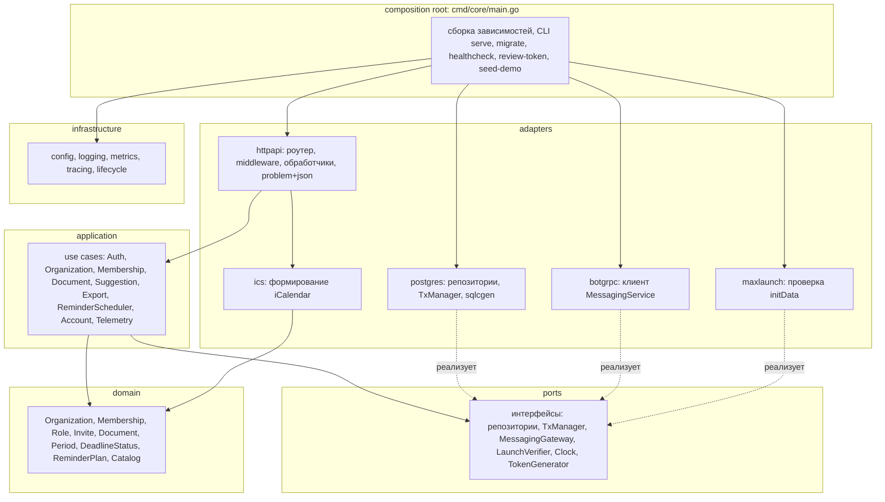
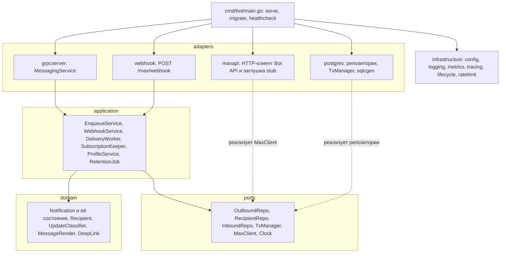

# Спецификации backend-сервисов

Версия 1.0.0 · 20.09.2026. Полные задания на реализацию — [handoffs/core-service.md](../handoffs/core-service.md) и [handoffs/bot-service.md](../handoffs/bot-service.md); они нормативны для алгоритмов и тестов.

## 1. Общая слоистая структура

| Слой | Каталог | Содержит | Может зависеть от |
|---|---|---|---|
| domain | `internal/domain` | сущности, value objects, инварианты, чистые функции (статусы, план напоминаний, политика ролей) | только стандартная библиотека |
| application | `internal/application` | use cases: транзакционные сценарии, проверка прав, вызовы портов | domain, ports |
| ports | `internal/ports` | интерфейсы репозиториев, TxManager, внешних шлюзов, часов, генератора токенов | domain |
| adapters | `internal/adapters` | HTTP/gRPC обработчики, PostgreSQL (sqlc), клиенты внешних систем | application, ports, domain, gen |
| infrastructure | `internal/infrastructure` | конфигурация, логирование, метрики, трассировка, жизненный цикл | стандартная библиотека и SDK |
| composition root | `cmd/<svc>/main.go` | сборка графа зависимостей, CLI-подкоманды, запуск и остановка | все слои |

Правило проверки: `go list -deps ./services/<svc>/internal/domain/...` не содержит пакетов `internal/adapters`, `internal/infrastructure`, `pgx`, `grpc` (тест T-ARCH в каждом сервисе).

## D4. Внутренняя структура backend-сервиса (core)

## D4b. Внутренняя структура backend-сервиса (bot)

## 2. Сервис core

| Аспект | Спецификация |
|---|---|
| Назначение | Публичный API мини-приложения и вся предметная логика: идентификация, организации, участники, приглашения, справочник, документы, периоды, план и планировщик напоминаний, экспорт ICS |
| Входящие интерфейсы | HTTP `:8080` — все операции [openapi.yaml](../../openapi.yaml) (30 операций, 21 путь); admin HTTP `:8081` — `/healthz`, `/readyz`, `/metrics`; CLI: `serve`, `migrate up`, `migrate down-to <v>`, `healthcheck`, `review-token issue/revoke`, `seed-demo` |
| Исходящие | PostgreSQL (схема `core`, роль `core_app`); gRPC `bot:9090` (`EnqueueNotification`, `GetRecipientStatus`, `GetBotProfile`) с deadline 2 с |
| Данные | таблицы схемы `core` ([data-model](../database/data-model.md)) |
| Фоновые задачи | ReminderScheduler (каждые 15 с, пакет 200); RetentionJob (каждый час): удалить сессии с `expires_at < now − 1 сут`, экспорты с `expires_at < now − 1 сут`, неактивные напоминания и аудит старше 180 дней |
| Идемпотентность | создание организации, документа, пакета, периода, приглашения — по клиентскому UUID; передача напоминаний в bot — по ключу `rem:<period>:<account>:<days>` |
| Конкурентность | изменения внутри организации сериализуются блокировкой строки `organizations` (`SELECT … FOR UPDATE`); оптимистичная блокировка по `version` для PATCH |
| Ограничения нагрузки | не более 256 одновременных HTTP-запросов (иначе 503 `OVERLOADED`, `Retry-After: 1`); лимит на аккаунт 10 запросов/с, всплеск 30; создание сессий 10/мин на пользователя MAX, 300/мин на IP |
| Таймауты | чтение заголовков 5 с, чтение тела 10 с, запись ответа 15 с, idle 60 с; бюджет обработчика 5 с (контекст), запрос к БД — остаток бюджета |
| SLO | p95 ≤ 300 мс, p99 ≤ 800 мс, доступность API 99 % в месяц (один хост) |
| Масштабирование | вертикально до 4 vCPU; горизонтально — несколько реплик за edge без изменений кода (сессии в БД, планировщик с `SKIP LOCKED`) |
| Поведение при отказах | bot недоступен: CRUD работает, `/me` возвращает `reminders_channel.state = unavailable`, создание приглашения — 503 `DEPENDENCY_UNAVAILABLE` без кэша профиля, напоминания остаются `planned` с backoff; БД недоступна: `/readyz` 503, запросы 503 |

## 3. Сервис bot

| Аспект | Спецификация |
|---|---|
| Назначение | Единственный держатель токена бота; приём событий MAX, учёт состояния диалогов, очередь исходящих сообщений с ограничением скорости, подписка webhook, профиль бота |
| Входящие интерфейсы | gRPC `:9090` — `vovremya.bot.v1.MessagingService` и `grpc.health.v1.Health`; HTTP `:8080` — `POST /max/webhook`; admin `:8081` — `/healthz`, `/readyz`, `/metrics`, в режиме stub — `GET /debug/stub/messages`; CLI: `serve`, `migrate up`, `healthcheck` |
| Исходящие | PostgreSQL (схема `bot`, роль `bot_app`); MAX Bot API `https://botapi.max.ru` (`GET /me`, `GET /subscriptions`, `POST /subscriptions`, `POST /messages`, `PATCH /me/commands`) |
| Данные | `bot.inbound_updates`, `bot.recipients`, `bot.outbound_messages`, `bot.outbound_buttons` |
| Фоновые задачи | DeliveryWorker (4 горутины, опрос каждые 500 мс, пакет 50, lease 60 с); LeaseReaper (каждые 30 с); SubscriptionKeeper (каждые 10 мин, live); ProfileService (до успеха каждые 30 с, затем каждые 6 ч); RetentionJob (каждый час: `inbound_updates` старше 7 сут, финальные сообщения старше 30 сут) |
| Лимиты | глобально 20 вызовов Bot API в секунду; на получателя — одно сообщение в 600 мс; очередь: при > 50 000 строк в статусах `queued`/`retry_wait` `EnqueueNotification` отвечает `RESOURCE_EXHAUSTED` |
| Идемпотентность | `idempotency_key` уникален; повтор с тем же `request_hash` → `duplicate=true`; с другим → `ALREADY_EXISTS`; webhook — `sha256(тело)` |
| SLO | постановка в очередь p99 ≤ 50 мс; 99 % напоминаний отправлены в MAX в течение 5 минут после `due_at` при доступном MAX |
| Поведение при отказах | MAX недоступен: сообщения в `retry_wait`, gRPC и webhook работают; БД недоступна: gRPC `UNAVAILABLE`, webhook 503 (MAX повторит), `/readyz` 503 |

# Архитектура 2.0.0: три сервиса

## Состав и ответственность

| Сервис | Ответственность | Не отвечает за | Данные | Входящие интерфейсы | Исходящие интерфейсы |
|---|---|---|---|---|---|
| core-service | публичный HTTP API, идентификация, справочник, организации и участники, документы и периоды, экспорт, журнал действий, outbox | план напоминаний, доставка в MAX | схема core | HTTP /api/v1 | gRPC → reminders (события, чтение плана), gRPC → bot (статус получателя, профиль, member_joined) |
| reminders-service | план напоминаний, расписание, повторы, отмена, восстановление, текст напоминания | источник истины по документам, доставка в MAX, публичный API | схема reminders | gRPC IngestService, ReminderQueryService, Health | gRPC → bot (EnqueueNotification) |
| bot-service | канал MAX: webhook, очередь доставки, состояния получателей, токен бота | правила сроков напоминаний | схема bot | HTTP webhook, gRPC MessagingService | HTTPS → MAX Bot API |

Граф вызовов ациклический: core → reminders, core → bot, reminders → bot.
Синхронных обратных вызовов reminders → core нет: рассогласование обнаруживается ответами
`ApplyEvents` и `GetIngestState`, которые инициирует core.

## Отказные сценарии

| Отказ | Последствие | Что продолжает работать |
|---|---|---|
| reminders-service недоступен | план не пересчитывается, `next_reminder_at` не выдаётся, `reminders_state=pending` или `unavailable` | вход, реестр, создание и изменение документов, экспорт |
| bot-service недоступен | напоминания остаются в плане и повторяются с выдержкой; статус канала в `/me` — unavailable | весь публичный API и приём событий |
| core-service недоступен | новые изменения не поступают | ранее запланированные напоминания отправляются по расписанию |
| PostgreSQL недоступен | сервисы отвечают 503 или UNAVAILABLE, readiness отрицательный | — |

## Правила слоёв (ADR-025)

| Пакет | Может импортировать |
|---|---|
| internal/domain | только стандартную библиотеку |
| internal/ports | свой domain |
| internal/app | свои domain и ports |
| internal/adapters/* | свои app, ports, domain, общий каркас, генерируемый код, SDK |
| internal/platform | стандартную библиотеку и SDK; никогда сервисы |
| cmd | всё перечисленное |

Адаптеры не импортируют друг друга. Модули core-service не импортируют друг друга.
Правила проверяются архитектурными тестами (`services/reminders/internal/archtest` — образец для остальных сервисов).

## Масштабирование

| Сервис | Единица масштабирования | Ограничение |
|---|---|---|
| core-service | экземпляры за обратным прокси | соединения PostgreSQL |
| reminders-service | экземпляры; захват плана безопасен благодаря SKIP LOCKED и аренде | скорость приёма bot-service |
| bot-service | один экземпляр по умолчанию (владелец токена и очереди) | лимиты MAX API |
