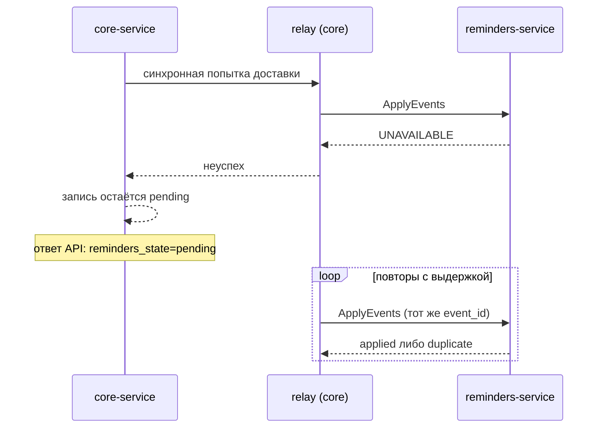
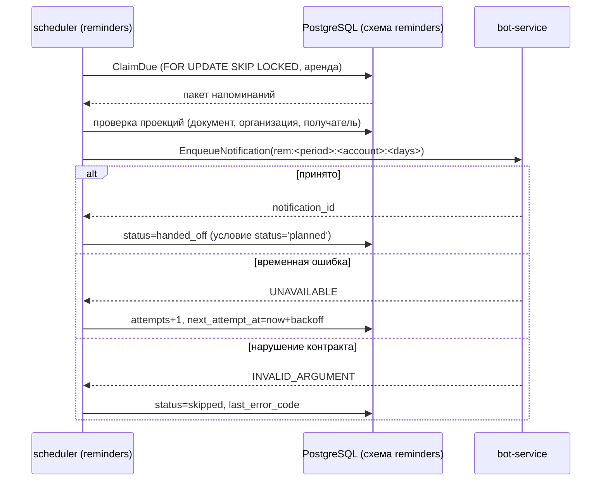
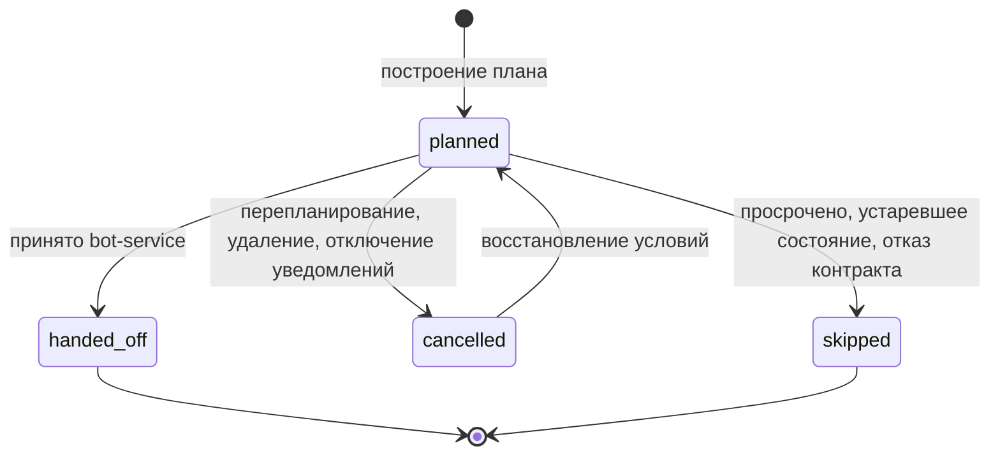
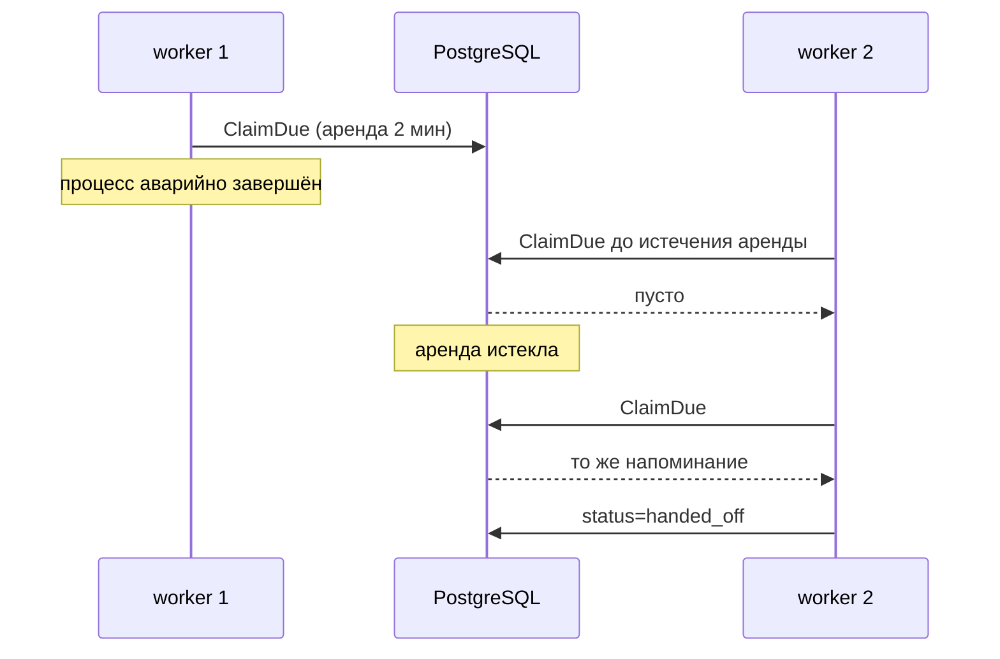

# Межсервисная согласованность core ↔ reminders

Версия 2.0.0. Нормативный документ. Дополняет ADR-020, ADR-021, ADR-022, ADR-024.

## 1. Что изменилось относительно версии 1.0.0

| Свойство | v1.0.0 (два сервиса) | v2.0.0 (три сервиса) |
|---|---|---|
| Перестроение плана | в транзакции изменения документа | отдельная транзакция reminders-service после доставки события |
| Гарантия при отказе | транзакция не фиксируется | изменение фиксируется, событие сохраняется в outbox и доставляется позже |
| Видимость результата | немедленно | немедленно в обычном режиме (синхронная попытка ≤ 300 мс), иначе с задержкой |
| Источник `next_reminder_at` | таблица core | gRPC-запрос в reminders-service |

## 2. Гарантии

Обещается:
- **durable acceptance** — принятая операция не теряется: изменение и событие пишутся одной транзакцией core;
- **at-least-once** доставка события;
- **идемпотентная обработка** — повтор доставки не повторяет бизнес-действие (ключ `event_id`);
- **порядок в пределах агрегата** — события с версией не больше применённой отбрасываются;
- **не более одного сообщения** на (период, получатель, отступ) — ключ идемпотентности bot-service.

Не обещается:
- exactly-once доставка;
- глобальный порядок событий между разными агрегатами;
- мгновенная согласованность плана при недоступности reminders-service.

Запись в outbox **не** считается доставкой: состояние доставки хранится в самой записи и подтверждается ответом `ApplyEvents`.

## 3. Матрица изменений, влияющих на напоминания

| Операция | Источник | Владелец данных | Транзакция сохранения | Событие | Что меняет reminders | Допустимое отставание |
|---|---|---|---|---|---|---|
| Создание документа | POST /documents | core | документ + outbox | DOCUMENT_STATE | проекция документа, план периода | 300 мс обычно, 60 с предел |
| Изменение документа | PATCH /documents/{id} | core | документ + outbox | DOCUMENT_STATE | проекция, перестроение плана | то же |
| Изменение периода, продление | POST /documents/{id}/renewals | core | период + outbox | DOCUMENT_STATE (новый period_id) | отмена плана прежнего периода, план нового | то же |
| Удаление документа | DELETE /documents/{id} | core | документ + outbox | DOCUMENT_DELETED | отметка удаления, отмена плана | то же |
| Изменение настроек уведомлений | PUT /organizations/{id}/notification-settings | core | участие + outbox | MEMBERSHIP_STATE | проекция участия, перестроение плана организации | то же |
| Изменение часового пояса | PATCH /organizations/{id} | core | организация + outbox | ORGANIZATION_STATE | проекция, перестроение всех документов организации | то же |
| Добавление участника | POST /invites/{token}/accept | core | участие + outbox | MEMBERSHIP_STATE | план для нового получателя | то же |
| Исключение участника | DELETE /organizations/{id}/members/{account} | core | участие + outbox | MEMBERSHIP_REMOVED | отмена плана участника | то же |
| Удаление организации | DELETE /organizations/{id} | core | организация + outbox | ORGANIZATION_DELETED | отметка удаления, отмена плана организации | то же |
| Удаление аккаунта | DELETE /me | core | аккаунт + outbox | ACCOUNT_DELETED | отмена плана получателя, удаление проекций участий | то же |
| Повторное создание задания | relay | core | — | тот же `event_id` | duplicate, изменений нет | — |
| Отмена напоминания | reminders | reminders | транзакция reminders | — | статус cancelled | — |
| Изменение статуса получателя | bot | bot | транзакция bot | — | не влияет на план; доставка решается bot | — |

## 4. Протокол доставки

1. **Запись.** core в транзакции изменения вставляет строку `core.outbox_events`
   (`event_id`, тип, агрегат, версия агрегата, payload, `created_at`, `status='pending'`, `attempts`, `next_attempt_at`).
2. **Выбор.** Relay выбирает пакет до 200 строк: `SELECT ... WHERE status='pending' AND next_attempt_at <= now()
   ORDER BY id FOR UPDATE SKIP LOCKED` и продлевает аренду. Параллельный захват одной строки исключён.
3. **Вызов.** Пакет передаётся `IngestService/ApplyEvents` со сроком 2 с.
4. **Приём.** Событие считается принятым, когда reminders зафиксировал транзакцию
   (запись в `reminders.inbox_events` + изменение проекции и плана) и вернул исход по событию.
5. **Подтверждение.** core переводит строку в `sent` с отметкой времени и исходом.
6. **Таймаут после успешной обработки.** core повторит доставку; reminders вернёт `duplicate`, повторного действия нет.
7. **Падение core после подтверждения получателя.** Запись осталась `pending`; повтор приведёт к `duplicate`.
8. **Повторная доставка.** Распознаётся по `event_id`; проекция и план не меняются.
9. **Нарушение порядка.** Событие с `aggregate_version` не больше применённой возвращает `stale` и игнорируется.
10. **Устаревшие версии агрегата.** Хранится последняя применённая версия на агрегат; она же отдаётся в `GetIngestState`.
11. **Повторы.** Задержка `min(5 мин, 10 с × 2^attempts)` плюс случайная добавка до 5 с.
12. **Ограничение параллелизма.** Не более 4 одновременных вызовов relay.
13. **Длительная недоступность reminders.** Записи накапливаются в outbox; метрика возраста старейшей записи
    и число `pending` выводятся в мониторинг; интерфейс сообщает, что пересчёт выполняется.
14. **Застрявшие события.** Возраст `pending` больше 15 минут — предупреждение; больше 1 часа — авария.
15. **Повторная обработка.** Снимок состояния агрегата отправляется повторно с новым `event_id` и флагом `snapshot`.
16. **Защита от устаревшего обработчика.** Аренда строки outbox и строки напоминания ограничена по времени;
    обновление выполняется с условием на текущий статус, поэтому обработчик с истёкшей арендой не перезапишет результат.
17. **Остановка.** Relay завершает текущий пакет и не берёт новый; незавершённые строки остаются `pending`.

## 5. Сверка и восстановление

- core периодически сравнивает версию агрегата с `GetIngestState`; при отставании формирует снимок.
- Снимок — обычное событие с полным состоянием агрегата и флагом `snapshot=true`.
- Первичная загрузка reminders-service выполняется снимками всех действующих организаций, участий и документов.
- Расхождение обнаруживается также при чтении: `GetSyncStatus` возвращает `in_sync=false`, если версия агрегата в core новее.

## 6. Семантика AC-05

Исходное требование: после продления документа в карточке отображается пересчитанное ближайшее напоминание.

Решение: core после фиксации транзакции выполняет синхронную попытку доставки события
с пределом `CORE_REMINDERS_SYNC_FLUSH_TIMEOUT` (300 мс). Ответ API содержит `reminders_state`:
- `actual` — событие применено, план пересчитан, `next_reminder_at` актуален;
- `pending` — событие сохранено, пересчёт продолжается в фоне; значение плана не выдаётся за актуальное;
- `unavailable` — reminders-service недоступен; значение плана не возвращается.

Измеримый предел: p95 перехода `pending → actual` — не более 2 с, предельное значение — 60 с при доступном сервисе.
Процедура проверки описана в docs/testing/test-strategy.md (сценарий T-CONS-01).

## 7. Диаграммы

### 7.1 Изменение документа и перепланирование

```mermaid
sequenceDiagram
    participant FE as Mini App
    participant CORE as core-service
    participant DB as PostgreSQL (схема core)
    participant REL as relay (core)
    participant REM as reminders-service
    FE->>CORE: PATCH /documents/{id}
    CORE->>DB: BEGIN; UPDATE documents; INSERT outbox_events; COMMIT
    CORE->>REL: синхронная попытка доставки (≤300 мс)
    REL->>REM: ApplyEvents([DOCUMENT_STATE])
    REM->>REM: inbox + проекция + перестроение плана (одна транзакция)
    REM-->>REL: applied, applied_version
    REL-->>CORE: успех
    CORE-->>FE: 200, reminders_state=actual
```

### 7.2 Отказ reminders-service



### 7.3 Передача напоминания в bot-service



### 7.4 Состояния напоминания



### 7.5 Восстановление после сбоя обработчика



## 8. Гонки и их разрешение

| Гонка | Разрешение | Проверка |
|---|---|---|
| Перепланирование во время отправки | обновление статуса выполняется с условием `status='planned'`; при проигрыше сообщение уже принято bot-service и повторно не ставится | TestSchedulerConcurrentTicksSendOnce |
| Удаление документа во время отправки | планировщик перечитывает проекции перед вызовом bot и пропускает напоминание | TestSchedulerDoesNotSendForDeletedDocument |
| Изменение получателя во время отправки | та же проверка проекции участия | TestSchedulerDoesNotSendForDeletedDocument (общий механизм) |
| Два экземпляра планировщика | `FOR UPDATE SKIP LOCKED` + аренда | TestSchedulerConcurrentTicksSendOnce |
| Истечение аренды и возврат старого обработчика | обновление с условием на статус; строка уже обработана новым обработчиком | TestLeaseReturnsReminderAfterCrash |
