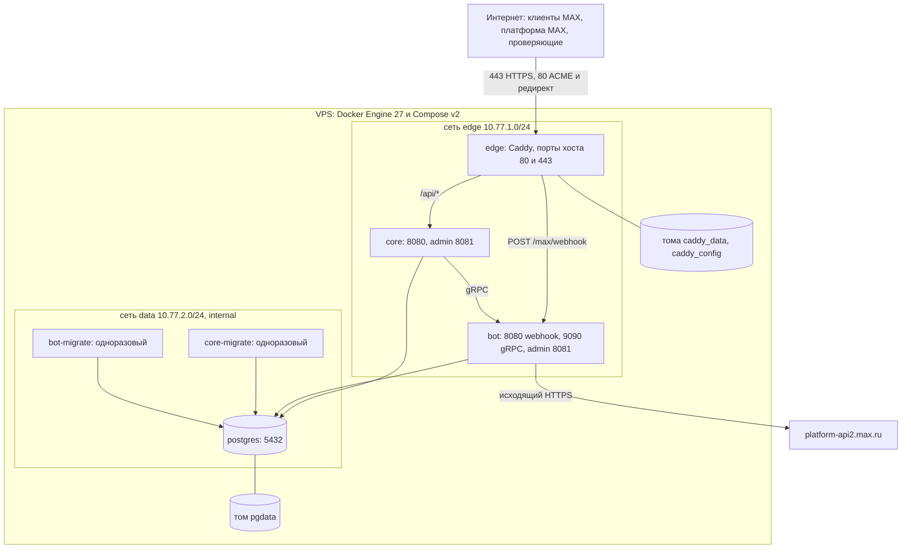

# Развёртывание в Docker Compose

Версия 1.0.0 · 20.09.2026. Файл — [compose.yaml](../../compose.yaml); эксплуатация — [compose-and-runbook.md](../operations/compose-and-runbook.md).

## D9. Схема развёртывания

| Сервис | Образ | Сети | Порты хоста | Лимиты | Healthcheck | Зависит от |
|---|---|---|---|---|---|---|
| postgres | postgres:18-alpine | data | — | 2 CPU, 1 ГБ | `pg_isready` | — |
| core-migrate | vovremya/core | data | — | — | — | postgres healthy |
| bot-migrate | vovremya/bot | data | — | — | — | postgres healthy |
| bot | vovremya/bot | edge, data | — | 0.5 CPU, 128 МБ | `/app/bot healthcheck` | bot-migrate completed |
| core | vovremya/core | edge, data | — | 1 CPU, 256 МБ | `/app/core healthcheck` | core-migrate completed |
| edge | vovremya/edge | edge | `${EDGE_HTTP_PORT:-8080}:80`, `${EDGE_HTTPS_PORT:-8443}:443` | 0.5 CPU, 128 МБ | `wget :8088/healthz` | core, bot healthy |
| prometheus | prom/prometheus | data | `127.0.0.1:9091` | — | — | профиль `monitoring` |
| postgres-test | postgres:18-alpine | default | `127.0.0.1:55432` | tmpfs | `pg_isready` | профиль `test` |
| k6 | grafana/k6 | edge | — | — | — | профиль `loadtest` |

Порядок запуска: postgres → миграции → bot → core → edge. Команда `healthcheck` каждого Go-сервиса выполняет `GET http://127.0.0.1:8081/readyz` с таймаутом 2 с и завершается кодом 0 при ответе 200.

Сеть `data` помечена `internal: true`: PostgreSQL не имеет выхода в интернет и недоступен edge. Bot выходит в интернет через сеть `edge`.

Образ PostgreSQL 18 хранит данные в `/var/lib/postgresql/18/docker`; том `pgdata` монтируется в `/var/lib/postgresql`, что корректно и для этой, и для прежней схемы каталогов.
