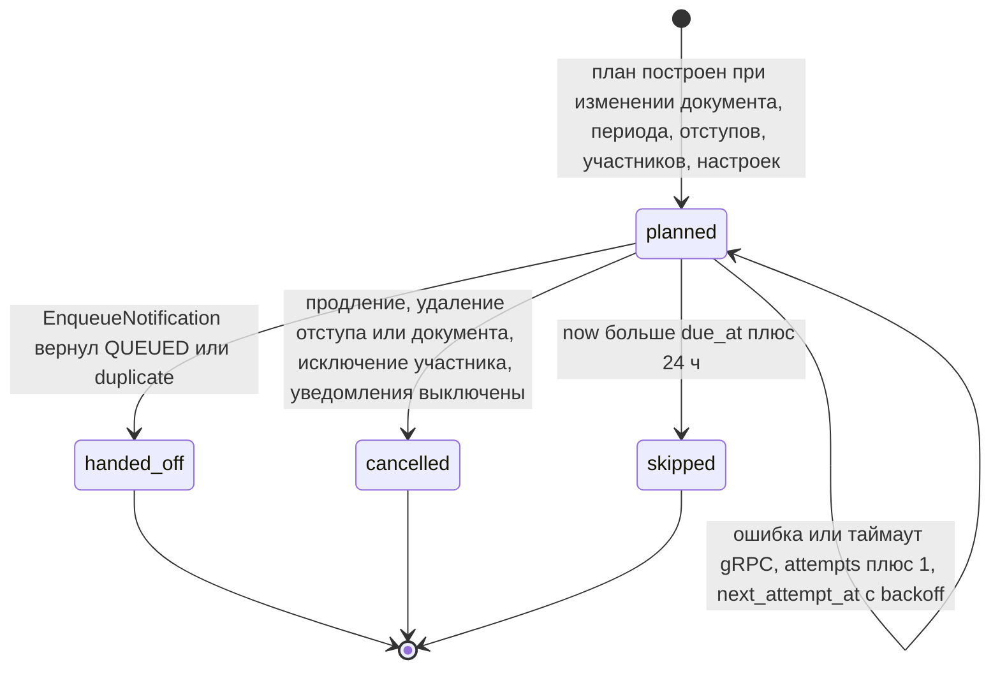
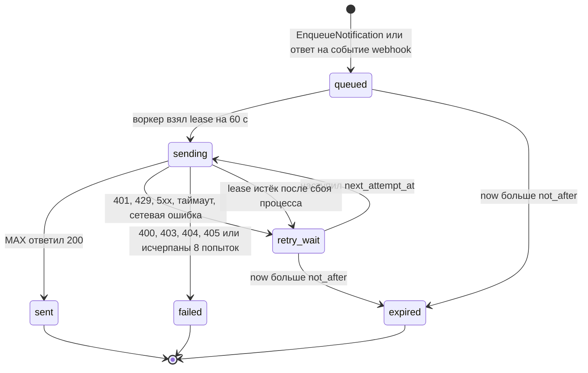
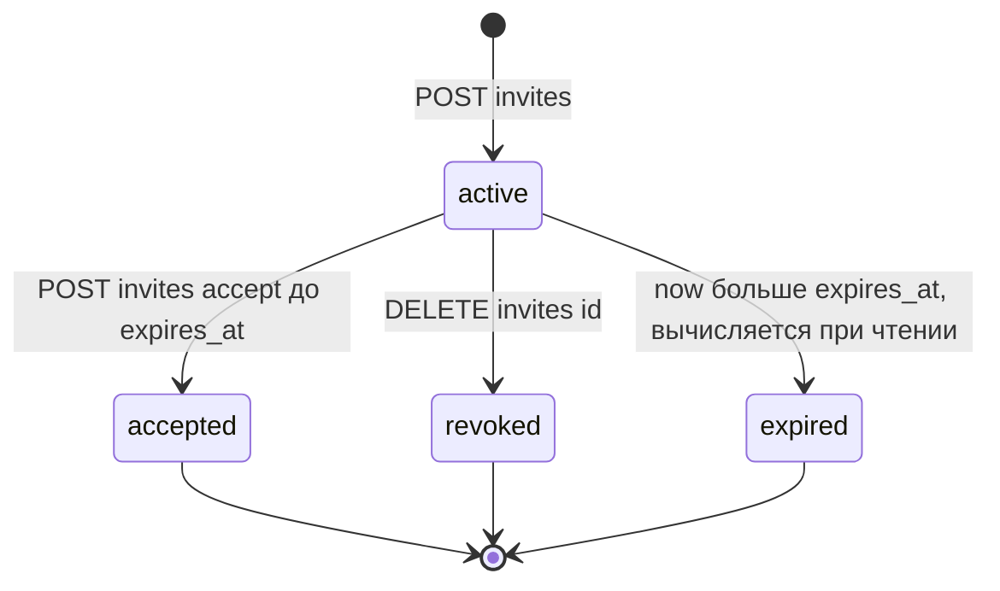
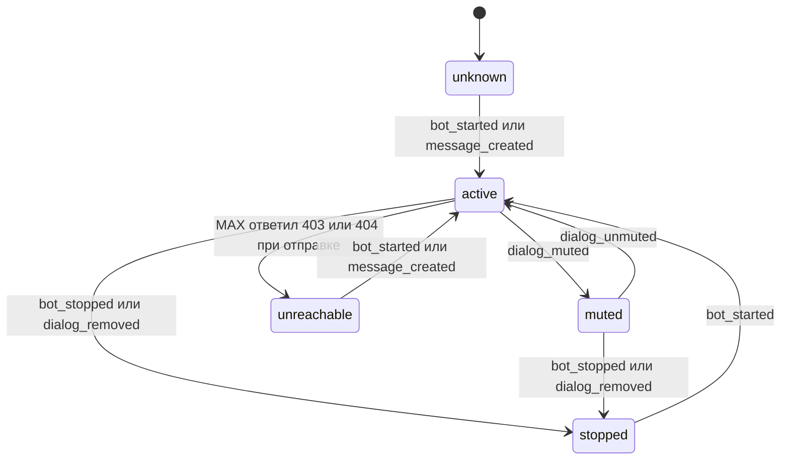

# Длительные операции и состояния

Версия 1.0.0 · 20.09.2026. Решение — ADR-010.

## D8-1. Напоминание в core (`core.reminders.status`)

| Переход | Условие | Транзакция |
|---|---|---|
| → planned | `due_at ≥ now()`; участник с `notify_enabled`; период текущий с `valid_until` | та же, что изменение документа или настроек |
| planned → handed_off | ответ bot без ошибки | транзакция планировщика, строка заблокирована `FOR UPDATE SKIP LOCKED` |
| planned → planned | gRPC `UNAVAILABLE`, `DEADLINE_EXCEEDED`, `RESOURCE_EXHAUSTED`; `next_attempt_at = now + min(5 мин, 10 с × 2^attempts) + случайно 0…5 с` | та же |
| planned → skipped | `now > due_at + 24 ч` (напоминание устарело) | та же |
| planned → cancelled | перепланирование | транзакция изменения |

Перепланирование (функция `domain.PlanReminders`) вычисляет желаемое множество `(period_id, account_id, days_before, due_at)` и сравнивает с существующими строками `planned`: недостающие вставляются (`ON CONFLICT DO NOTHING`), лишние переводятся в `cancelled`, строки `handed_off` не трогаются.

## D8-2. Сообщение в bot (`bot.outbound_messages.status`)

## D8-3. Приглашение (`core.invites`)

## D8-4. Получатель (`bot.recipients.state`)

## Отмена, повтор и конкурентность

| Ситуация | Поведение |
|---|---|
| Пользователь продлил документ, пока напоминание в `planned` | транзакция продления переводит напоминания старого периода в `cancelled` |
| Продление после `handed_off`, но до отправки | сообщение уйдёт (уже в очереди bot); текст содержит дату окончания, пользователь увидит в карточке новый срок. Отмена в bot не реализуется: окно ≤ 15 с + время очереди |
| Два экземпляра планировщика | `FOR UPDATE SKIP LOCKED` исключает двойную обработку |
| Рестарт core во время передачи | транзакция не зафиксирована → строка остаётся `planned` → повтор с тем же ключом → bot вернёт `duplicate=true` |
| Рестарт bot во время отправки | строка `sending` с истёкшим lease возвращается в `retry_wait`; возможен дубль, если MAX уже принял сообщение |
| Webhook повторён MAX | дедупликация по `sha256(тело)` |
