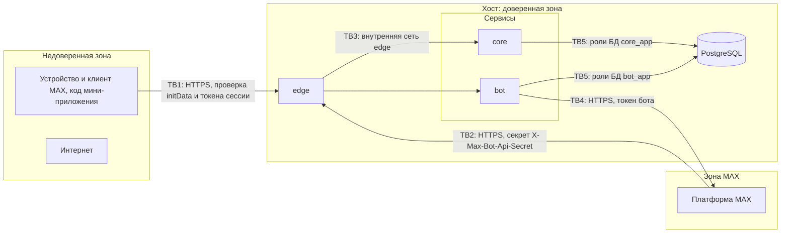

# Безопасность

Версия 1.0.0 · 20.09.2026. Пояснения «простыми словами» даны для участников без опыта администрирования.

## 1. Границы доверия

Простыми словами: всё, что приходит с телефона пользователя, может быть подделано — поэтому сервер сам проверяет подпись MAX и права на каждое действие. Внутрь хоста снаружи пускают только через edge, а база данных вообще не видна из интернета.

## 2. Угрозы и меры

| Угроза | Граница | Мера | Проверка |
|---|---|---|---|
| Подделка личности (чужой `user.id`) | TB1 | HMAC-подпись `initData`, производный ключ только на сервере | T-SEC-01 |
| Повтор старого `initData` | TB1 | срок 1 ч, допуск будущего 60 с, лимиты создания сессий | T-DOM-AUTH (TV-4, TV-5) |
| Кража токена сессии | TB1 | HTTPS, срок 12 ч, отзыв при выходе и удалении аккаунта, в БД только SHA-256; CSP без inline-скриптов | T-SEC-02 |
| Доступ к чужой организации (IDOR) | core | каждый запрос проверяет членство и роль; чужие ресурсы → 404 | T-NFR-PERM |
| Повышение роли | core | роли меняет только владелец; владелец один (уникальный индекс) | T-NFR-PERM |
| Подделка webhook | TB2 | секрет, сравнение постоянного времени; 401 без обработки | AC-MAX-07 |
| Утечка токена бота | TB4 | только в bot, не логируется; core получает производный ключ; `.env` с правами 600 | T-SEC-05 |
| SQL-инъекции | TB5 | только параметризованные запросы sqlc; поиск экранирует `%` и `_` | T-NFR-MAL |
| XSS | TB1 | React экранирует вывод; `dangerouslySetInnerHTML` запрещён линтером; CSP `script-src 'self' https://st.max.ru` | T-SEC-03 |
| Clickjacking | TB1 | CSP `frame-ancestors` только для MAX | T-INT-EDGE |
| Отказ в обслуживании | TB1 | лимиты частоты, семафор, размер тела 256 KB, таймауты чтения | T-NFR-LOAD, T-NFR-MAL |
| Фишинговая ссылка в документе | TB1 | только `https://`, открытие во внешнем браузере через `openLink` | T-FE-VAL |
| Подбор токенов приглашений и ссылок экспорта | TB1 | 256 бит случайности, хранение хешей, срок 72 ч и 10 мин, лимиты | T-SEC-04 |
| Горизонтальное перемещение из core в данные bot | TB5 | роль `core_app` без `USAGE` на схему `bot` | T-PG-ISO |
| Секреты в репозитории | — | `.gitignore`, значения `devonly_`, отказ запуска prod с dev-секретами | T-SEC-05, T-SEC-06 |
| Уязвимые или несвободные зависимости | — | `govulncheck`, `npm audit --omit=dev`, проверка лицензий | T-SEC-08 |

## 3. Матрица прав

| Операция | viewer | editor | owner | Прочие правила |
|---|---|---|---|---|
| Просмотр организации, документов, участников, подсказок, экспорт | да | да | да | не участник → 404 |
| Изменение профиля организации | нет | да | да | |
| Создание, изменение, продление, удаление документов | нет | да | да | |
| Удаление организации | нет | нет | да | |
| Приглашения: создание, список, отзыв | нет | нет | да | |
| Смена роли участника | нет | нет | да | роль владельца не меняется |
| Исключение участника | нет | нет | да | владельца исключить нельзя |
| Выход из организации | да | да | нет | владелец удаляет организацию |
| Свои настройки уведомлений | да | да | да | |

## 4. Проверка входных данных

Сервер валидирует каждое поле по ограничениям [openapi.yaml](../../openapi.yaml) до обращения к БД: длины строк после `strings.TrimSpace`, коды справочников по загруженному справочнику, часовой пояс через `time.LoadLocation`, даты в формате `YYYY-MM-DD`, `valid_until ≥ valid_from`, отступы 0–365 без повторов (не более 5), `reference_url` только `https://` без пробелов, неизвестные поля JSON → 400 (`DisallowUnknownFields`). Ошибки возвращаются списком `errors[]` с кодом поля. Ограничения таблиц БД дублируют ключевые правила.

## 5. Персональные данные

Простыми словами: храним только то, без чего сервис не работает, и умеем всё удалить по кнопке.

| Данные | Где | Зачем | Срок хранения |
|---|---|---|---|
| `max_user_id`, имя, фамилия, ник, язык | core.accounts | вход, отображение участников | до удаления аккаунта |
| `max_user_id`, состояние диалога | bot.recipients | доставка напоминаний | до удаления аккаунта MAX-пользователя из бота (строка удаляется при `dialog_removed` через 30 суток) |
| Тексты напоминаний (название документа, организации) | bot.outbound_messages | доставка | 30 суток после финального статуса |
| Документы (названия, номера, ответственный — должность) | core.documents | суть сервиса | до удаления документа или организации |
| Журнал действий | core.audit_events | расследование инцидентов | 180 суток |
| IP-адрес | не хранится; используется только в памяти для лимитов | — | — |

При первом запуске экран «Добро пожаловать» показывает уведомление об обработке данных и кнопку «Продолжить»; форма документа предупреждает: «Не вводите ФИО и паспортные данные сотрудников — укажите должность». Удаление: `DELETE /me` удаляет аккаунт и организации, где пользователь — владелец.

## 6. Секреты

| Секрет | Где хранится | Кто читает | Ротация |
|---|---|---|---|
| Токен бота | `.env` на сервере (600) | bot | по запросу организаторов; затем пересчитать производный ключ |
| Производный ключ initData | `.env` | core | вместе с токеном |
| Секрет webhook | `.env` | bot | при подозрении на утечку: новый секрет, перезапуск bot (подписка обновится) |
| Пароли ролей БД | `.env` | postgres (init), миграции, сервисы | `ALTER ROLE … PASSWORD` и перезапуск |
| Токены проверяющих | только первый слайд презентации | проверяющие | `review-token revoke` после проверки |

Простыми словами: файл `.env` на сервере — это «сейф»: его нет в git, читать его может только владелец (права 600), а если что-то утекло — меняем значение и перезапускаем контейнеры.

## 7. Лицензии

Разрешены MIT, BSD-2/3, Apache-2.0, ISC, MPL-2.0 (для файлов библиотеки), PostgreSQL License. Проверка: `go-licenses report ./...` и `npx license-checker --production --onlyAllow "MIT;BSD-2-Clause;BSD-3-Clause;Apache-2.0;ISC;MPL-2.0;0BSD"` (T-SEC-08). Используемые ключевые компоненты: Go (BSD-3), pgx (MIT), grpc-go (Apache-2.0), goose (MIT), React (MIT), MAX UI (MIT), TanStack Query (MIT), React Router (MIT), Caddy (Apache-2.0), PostgreSQL (PostgreSQL License).
