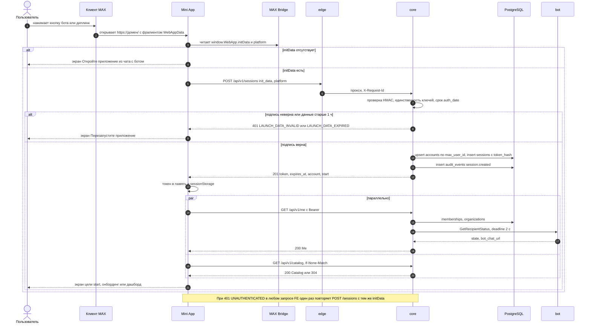
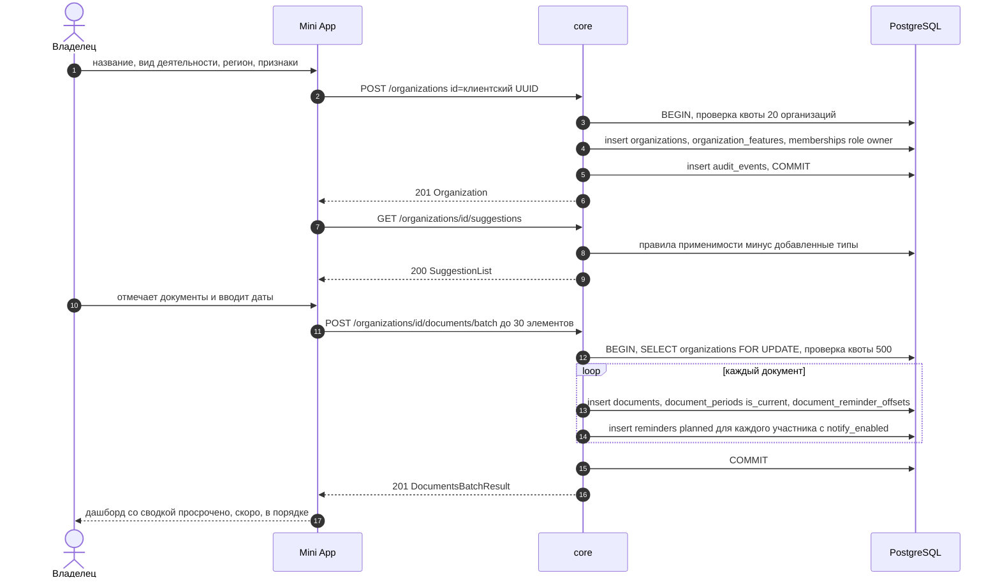
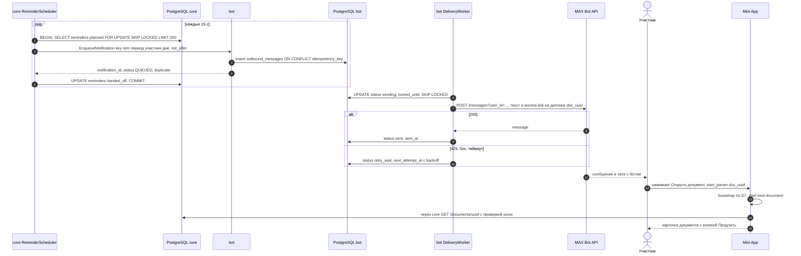
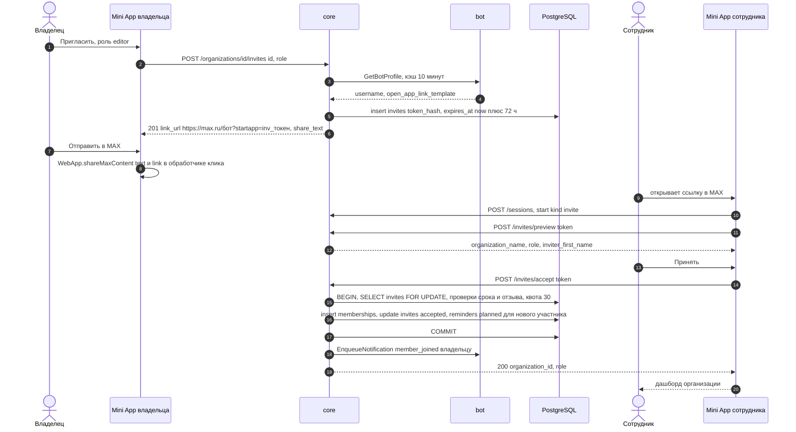
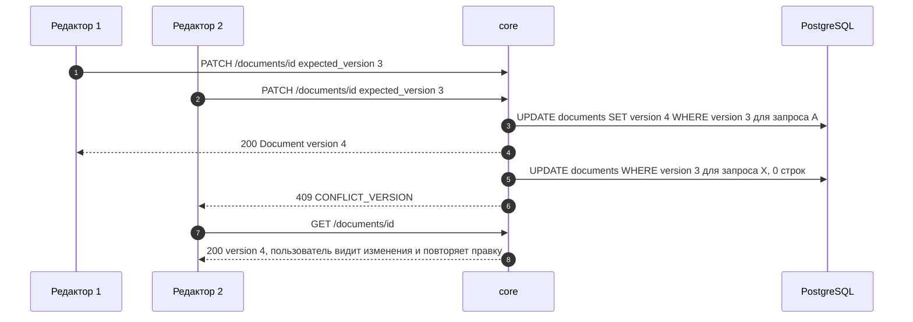

# Последовательности сценариев

Версия 1.0.0 · 20.09.2026. Коды ошибок — `ErrorCode` из [openapi.yaml](../../openapi.yaml).

## D7. Авторизация и инициализация

## D6-1. Онбординг и пакетное создание документов

## D6-2. Напоминание и открытие карточки

## D6-3. Приглашение сотрудника

## D6-4. Конкурентное изменение документа

