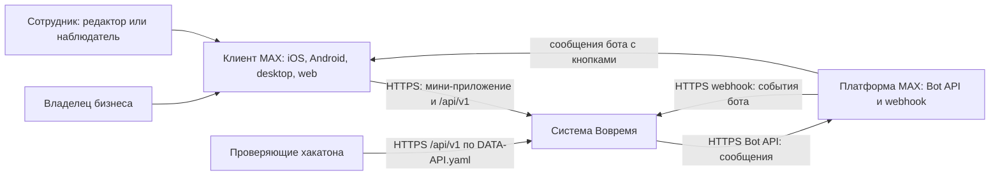
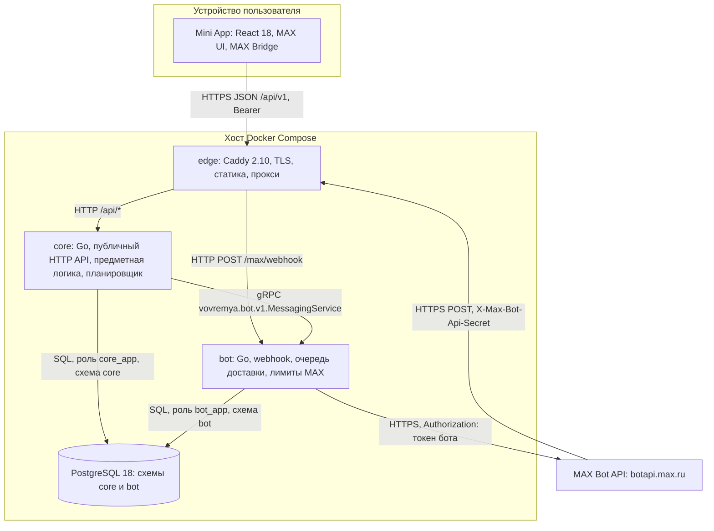
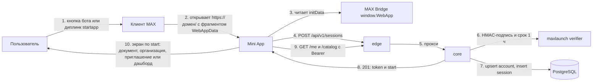

# Общая архитектура

Версия 1.0.0 · 20.09.2026

## D1. Контекст системы

## D2. Компоненты и микросервисы

| Компонент | Технология | Ответственность | Владелец |
|---|---|---|---|
| Mini App | React 18.3, TypeScript 5, Vite 7, @maxhub/max-ui, TanStack Query 5, React Router 7 | интерфейс, bootstrap, MAX Bridge | A |
| edge | Caddy 2.10 | TLS (ACME), статика, маршрутизация `/api/*` и `/max/webhook`, заголовки безопасности, `X-Request-Id` | B |
| core | Go 1.27 (минимум 1.26), pgx 5, sqlc, goose, grpc-go | сессии, организации, участники, приглашения, справочник, документы, напоминания, экспорт | B |
| bot | Go 1.27 (минимум 1.26), pgx 5, grpc-go | webhook, состояние диалогов, очередь сообщений, подписка, профиль бота | A |
| PostgreSQL | 18 (образ `postgres:18-alpine`) | хранение, схемы с раздельными ролями | B (core), A (bot) |

## D3. Путь MAX → Mini App → backend

Сквозные сценарии со всеми этапами (MAX → Mini App → public API → backend → PostgreSQL/bot → ответ → UI) — [sequences.md](sequences.md). Развёртывание — [deployment.md](deployment.md).
