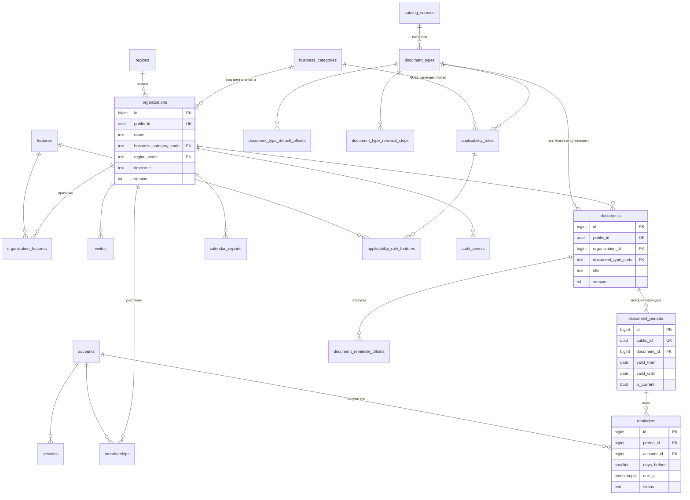

# Модель данных PostgreSQL

Версия 1.0.0 · 20.09.2026. Нормативный DDL: [core 00001](../../services/core/migrations/00001_init.sql), [core 00002 справочник](../../services/core/migrations/00002_catalog_seed.sql), [bot 00001](../../services/bot/migrations/00001_init.sql). Роли и схемы: [01-init.sh](../../deploy/postgres/init/01-init.sh).

## 1. Экземпляр, схемы, роли

Один экземпляр PostgreSQL 18, база `vovremya`, схемы `core` (владелец `core_migrator`) и `bot` (владелец `bot_migrator`). Роли приложений `core_app` и `bot_app` имеют DML только в своей схеме; справочные таблицы `core` доступны `core_app` только на чтение. Межсхемных внешних ключей и транзакций нет (ADR-006).

## 2. ER-диаграмма схемы core

## 3. ER-диаграмма схемы bot

```mermaid
erDiagram
  outbound_messages ||--o{ outbound_buttons : "кнопки 1-3"
  recipients {
    bigint max_user_id PK
    text state
    timestamptz last_event_time
  }
  outbound_messages {
    bigint id PK
    uuid public_id UK
    text idempotency_key UK
    bigint recipient_max_user_id
    text status
    timestamptz next_attempt_at
    timestamptz locked_until
  }
  outbound_buttons {
    bigint message_id PK
    smallint position PK
    text action
  }
  inbound_updates {
    bytea dedupe_key PK
    text update_type
    timestamptz event_time
  }
```

`outbound_messages.recipient_max_user_id` и `recipients.max_user_id` не связаны внешним ключом намеренно: сообщение может быть поставлено до первого события от пользователя.

## 4. Словарь данных

| Таблица | Ключ | Назначение | Ключевые столбцы и ограничения | Пишет |
|---|---|---|---|---|
| core.business_categories | code | виды деятельности | `code` `^[a-z][a-z0-9_]{1,39}$`, `title` уникален | миграции |
| core.regions | code | регионы ISO 3166-2:RU и `XX-OTHER` | `default_timezone` IANA | миграции |
| core.features | code | вопросы-признаки профиля | `question` ≤ 200 | миграции |
| core.catalog_sources | id | источники справочника | `url` https, `checked_on` NULL — не сверено | миграции |
| core.document_types | code | типы документов | `data_status` model/verified; verified требует источник | миграции |
| core.document_type_default_offsets | (type, days) | отступы по умолчанию | `days_before` 0–365 | миграции |
| core.document_type_renewal_steps | (type, step_no) | шаги продления | `step_text` ≤ 300 | миграции |
| core.applicability_rules | id | правило «категория + признаки» | категория NULL = любая | миграции |
| core.applicability_rule_features | (rule, feature) | признаки правила (все обязательны) | — | миграции |
| core.accounts | id; `public_id`, `max_user_id`, `review_login` уникальны | пользователи MAX и служебные | `kind` max/review с взаимоисключающими идентификаторами | core_app |
| core.sessions | id; `token_hash` уникален | серверные сессии | `token_hash` 32 байта, `expires_at > created_at` | core_app |
| core.organizations | id; `public_id` | организации | `name` 1–100, `version ≥ 1` | core_app |
| core.organization_features | (org, feature) | признаки организации | — | core_app |
| core.memberships | (org, account) | участие и настройки уведомлений | `role`; один owner (частичный уникальный индекс); `notify_local_time` без секунд | core_app |
| core.invites | id; `public_id`, `token_hash` | приглашения | роль editor/viewer; не одновременно принято и отозвано | core_app |
| core.documents | id; `public_id` | документы | `title` 1–200, `reference_url` https ≤ 1024 | core_app |
| core.document_periods | id; `public_id` | периоды действия | `valid_until ≥ valid_from`; один текущий на документ | core_app |
| core.document_reminder_offsets | (document, days) | отступы документа | 0–365; не более 5 — правило приложения | core_app |
| core.reminders | id; (period, account, days) | план напоминаний | `status`; `handed_off` ⇔ `handed_off_at` | core_app |
| core.calendar_exports | id; `token_hash` | ссылки ICS | `download_count` 0–3 | core_app |
| core.audit_events | id | журнал действий | `action` из перечня | core_app |
| bot.inbound_updates | dedupe_key | дедупликация webhook | `outcome` applied/ignored | bot_app |
| bot.recipients | max_user_id | состояние диалога | `state` 5 значений | bot_app |
| bot.outbound_messages | id; `idempotency_key` | очередь сообщений | `sending` ⇔ `locked_until`; `sent` ⇔ `sent_at`; текст ≤ 4000 | bot_app |
| bot.outbound_buttons | (message, position) | кнопки | `open_app` ⇔ payload, `url` ⇔ url | bot_app |

Суррогатные ключи `bigint identity` используются для соединений; наружу (API, gRPC, диплинки) выходят только `public_id` (UUID v4). UUID сущностей, создаваемых пользователем, генерирует клиент (идемпотентность); UUID периода при создании документа и аккаунтов генерирует сервер.

## 5. Нормализация

Функциональные зависимости (ФЗ) выписаны для каждой таблицы по реальной семантике.

| Таблица | ФЗ | Нормальная форма |
|---|---|---|
| organizations | id → public_id, name, category, region, timezone, version…; public_id → id | BCNF: все детерминанты — потенциальные ключи. `timezone` не зависит от `region_code`: регион даёт только значение по умолчанию, пользователь выбирает пояс сам |
| memberships | (org, account) → role, notify_enabled, notify_local_time, joined_at | BCNF: неключевые атрибуты зависят от всего ключа (настройки уведомлений — свойство участия, а не аккаунта) |
| documents | id → все атрибуты | BCNF: `title` не зависит от `document_type_code` (копируется при создании и редактируется) |
| document_periods | id → document, dates, is_current | BCNF; «один текущий период» — частичный уникальный индекс |
| reminders | id → все; (period, account, days) → id, due_at, status… | BCNF по ключам; `due_at` — вычислимое значение (см. контролируемая избыточность) |
| справочники | code → атрибуты | BCNF |
| bot.outbound_messages | id → все; idempotency_key → id | BCNF; `request_hash` зависит от ключа |

- **1НФ.** Все значения атомарны: нет массивов и JSON. Множества (признаки организации, отступы документа, отступы и шаги типа, признаки правила) вынесены в отдельные таблицы.
- **2НФ.** Во всех таблицах с составным ключом (`memberships`, `organization_features`, `document_reminder_offsets`, `document_type_*`, `applicability_rule_features`, `outbound_buttons`) неключевые атрибуты зависят от ключа целиком.
- **3НФ и НФБК.** Транзитивных зависимостей нет: например, имя организации не хранится в документах, заголовок типа — не в документах, имя участника — только в `accounts`.
- **4НФ.** Независимые многозначные факты разнесены: признаки организации и участники организации — разные таблицы; отступы типа и шаги продления типа — разные таблицы. Нет таблицы, где два независимых множества перемножены.
- **5НФ.** Тернарных отношений, разложимых на проекции без потерь и не выводимых из ключей, нет: `applicability_rule_features` — бинарная связь правила и признака; `reminders` — план по (период, получатель, отступ), где сочетание не восстанавливается соединением проекций (получатель может отключить уведомления, отступ — измениться), поэтому хранится как самостоятельный факт.
- **6НФ.** Не применяется ко всей модели: требований к истории изменения каждого атрибута нет, а разбиение на таблицы «ключ + один атрибут» усложнило бы все запросы. Единственный изменяющийся во времени факт с историей — срок действия — вынесен в `document_periods`, что соответствует идее 6НФ для этого атрибута.
- **ДКНФ.** Большинство правил выражены доменами (`CHECK`) и ключами. Не выражаются ограничениями домена и ключа: «не более 5 отступов», «не более 500 документов и 30 участников», «у организации ровно один владелец» (уникальный индекс гарантирует «не более одного»; «не менее одного» — логика удаления). Эти правила выполняет приложение в транзакции с блокировкой строки организации, поэтому модель сознательно не в ДКНФ.
- **Соединение без потерь.** Каждая декомпозиция соединяется по первичному ключу родителя (теорема Хита: общий атрибут — ключ одной из частей), поэтому все соединения без потерь.
- **Сохранение зависимостей.** Каждая ФЗ проверяется внутри одной таблицы первичным или уникальным ключом. Межтабличные правила (один текущий период, один владелец) — частичными уникальными индексами. Не сохраняется средствами БД только вычислимое `reminders.due_at`.
- **Контролируемая избыточность.** `reminders.due_at` выводится из `document_periods.valid_until`, `days_before`, `memberships.notify_local_time` и `organizations.timezone`. Хранение нужно для индекса планировщика (`next_attempt_at`), который невозможно построить по выражению над несколькими таблицами. Согласованность обеспечивает перепланирование в той же транзакции, что меняет любой из исходных атрибутов (ADR-010).
- **JSONB.** Не используется: все структуры известны и запрашиваются по полям. Тело webhook не хранится — только ключ дедупликации и извлечённые поля (минимизация персональных данных).

## 6. Индексы и запросы

| Индекс | Запрос |
|---|---|
| `sessions.token_hash` (unique) | аутентификация каждого запроса |
| `sessions_expires_idx` | удаление просроченных сессий |
| `memberships` PK, `memberships_account_idx` | проверка роли; список организаций пользователя |
| `memberships_one_owner_idx` | инвариант единственного владельца |
| `invites.token_hash`, `invites_org_active_idx` | принятие; список активных приглашений |
| `documents_org_idx` | список и сводка организации (≤ 500 строк сортируются в памяти) |
| `document_periods_one_current_idx` | текущий период документа |
| `document_periods_doc_created_idx` | история периодов |
| `reminders_due_idx` (partial `planned`) | выборка планировщика |
| `reminders_account_planned_idx` | отмена при выключении уведомлений и исключении участника |
| `reminders_updated_idx` | очистка истории |
| `outbound_ready_idx` (partial) | выборка воркера доставки |
| `outbound_lease_idx` (partial) | возврат просроченных lease |
| `outbound_recipient_idx` | диагностика доставки получателю |
| `inbound_updates_received_idx`, `outbound_final_idx`, `audit_events_occurred_idx` | очистка по сроку хранения |

## 7. Транзакции и блокировки

Уровень изоляции — READ COMMITTED (по умолчанию). Сериализация изменений внутри организации — `SELECT … FROM core.organizations WHERE id = $1 FOR UPDATE` первым оператором транзакции.

| Сценарий | Таблицы | Блокировки | Идемпотентность |
|---|---|---|---|
| Создание сессии | accounts, sessions, audit_events | upsert по `max_user_id` | нет (каждый вызов — новая сессия) |
| Создание организации | organizations, organization_features, memberships, audit_events | квота по членствам аккаунта | `public_id` + `created_by` |
| Создание документа или пакета | documents, document_periods, document_reminder_offsets, reminders | строка организации | `public_id` + организация + `created_by` |
| Изменение документа | documents, document_periods, document_reminder_offsets, reminders | строка организации, `version` | оптимистичная блокировка |
| Продление | document_periods, reminders, documents.version | строка организации | `public_id` периода |
| Настройки уведомлений | memberships, reminders | строка организации | PUT идемпотентен |
| Принятие приглашения | invites, memberships, reminders, audit_events | строка организации, строка приглашения | повтор → `ALREADY_MEMBER` |
| Планировщик | reminders | `FOR UPDATE SKIP LOCKED`, lease 2 мин через `next_attempt_at` | ключ `rem:…` в bot |
| Постановка сообщения | outbound_messages, outbound_buttons | уникальный `idempotency_key` | `request_hash` |
| Доставка | outbound_messages | `FOR UPDATE SKIP LOCKED`, lease 60 с | — |
| Webhook | inbound_updates, recipients, outbound_messages | PK `dedupe_key` | `sha256(тело)` |

## 8. Хранение и резервное копирование

| Данные | Срок | Механизм |
|---|---|---|
| Просроченные сессии | 1 сутки после `expires_at` | RetentionJob core |
| Ссылки экспорта | 1 сутки после `expires_at` | RetentionJob core |
| Напоминания не `planned` | 180 суток по `updated_at` | RetentionJob core |
| Журнал действий | 180 суток | RetentionJob core |
| inbound_updates | 7 суток | RetentionJob bot |
| Финальные сообщения бота | 30 суток | RetentionJob bot |

Резервное копирование: `pg_dump -Fc` ежесуточно в 03:00 по cron хоста, хранение 7 копий, копия вне хоста (runbook). Проверка восстановления — задача REL-02.
