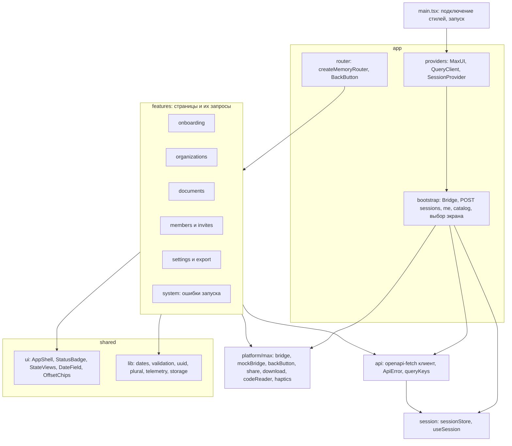
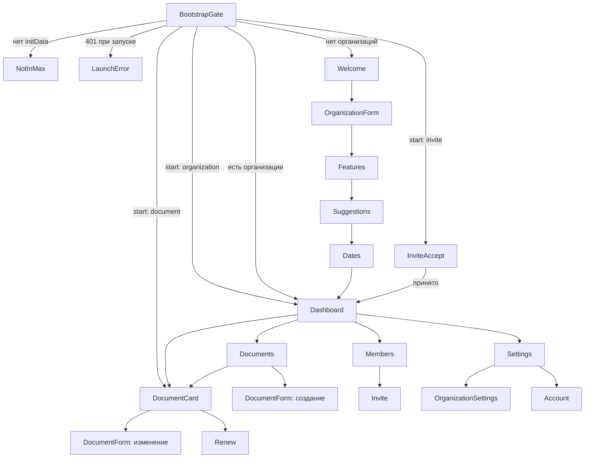

# Архитектура frontend Mini App

Версия 1.0.0 · 20.09.2026 · владелец: Разработчик A. Решение о стеке — ADR-003. Мини-приложение — основной и единственный пользовательский интерфейс продукта (BR-05).

## 1. Стек

| Назначение | Выбор | Версия (фиксируется `package-lock.json` в FE-01) |
|---|---|---|
| UI-библиотека | React, React DOM | 18.3.x |
| Компоненты MAX | `@maxhub/max-ui` (MIT) | последняя 0.x на 21.09.2026, точная версия без `^` |
| Язык | TypeScript, `strict: true` | 5.9.x |
| Сборка | Vite + `@vitejs/plugin-react` | 7.x |
| Серверное состояние | `@tanstack/react-query` | 5.x |
| Маршрутизация | `react-router` (`createMemoryRouter`) | 7.x |
| HTTP-клиент | `openapi-fetch` + типы `openapi-typescript` из [openapi.yaml](../../openapi.yaml) | 0.x / 7.x |
| Тесты | Vitest, `@testing-library/react`, `@testing-library/user-event`, jsdom, MSW 2 | актуальные на 21.09 |
| e2e | `@playwright/test` | 1.5x |
| Линтер | ESLint 9 + `typescript-eslint`, `eslint-plugin-react-hooks`, запрет `react/no-danger` | — |

## D5. Внутренняя структура frontend



Правила зависимостей: `features/*` не импортируют друг друга, кроме публичных компонентов через `shared`; `platform/max` — единственное место обращения к `window.WebApp`; `api/client.ts` — единственное место `fetch`.

## 2. Точная структура каталогов

```text
frontend/
  package.json, tsconfig.json, tsconfig.node.json, vite.config.ts, playwright.config.ts, eslint.config.js, index.html, .env.development
  src/vite-env.d.ts
  public/favicon.svg
  src/main.tsx
  src/app/App.tsx, providers.tsx, router.tsx, routes.ts, bootstrap.ts, ErrorBoundary.tsx
  src/platform/max/types.ts, bridge.ts, mockBridge.ts, backButton.ts, closingConfirmation.ts, share.ts, download.ts, codeReader.ts, haptics.ts, links.ts
  src/api/client.ts, errors.ts, queryKeys.ts, schema.d.ts (генерируется)
  src/session/sessionStore.ts, useSession.ts
  src/features/onboarding/WelcomePage.tsx, OrganizationFormPage.tsx, FeaturesPage.tsx, SuggestionsPage.tsx, DatesPage.tsx, onboardingDraft.ts
  src/features/organizations/DashboardPage.tsx, OrganizationSwitcher.tsx, OrganizationSettingsPage.tsx, api.ts
  src/features/documents/DocumentsPage.tsx, DocumentCardPage.tsx, DocumentFormPage.tsx, RenewPage.tsx, DocumentListItem.tsx, documentForm.ts, api.ts
  src/features/members/MembersPage.tsx, InvitePage.tsx, api.ts
  src/features/invites/InviteAcceptPage.tsx, api.ts
  src/features/settings/SettingsPage.tsx, AccountPage.tsx, api.ts
  src/features/export/CalendarExportButton.tsx, api.ts
  src/features/system/NotInMaxPage.tsx, LaunchErrorPage.tsx, NotFoundPage.tsx
  src/shared/ui/AppShell.tsx, StatusBadge.tsx, StateViews.tsx, DateField.tsx, OffsetChips.tsx, ConfirmDialog.tsx, ModelDataBadge.tsx
  src/shared/lib/dates.ts, uuid.ts, validation.ts, plural.ts, telemetry.ts, storage.ts
  src/shared/styles/app.css
  src/test/setup.ts, fixtures.ts, msw/handlers.ts, msw/server.ts
  тесты: src/shared/lib/dates.test.ts, validation.test.ts; src/features/documents/documentForm.test.ts, DocumentsPage.test.tsx; src/platform/max/bridge.test.ts; src/app/router.test.tsx
  e2e/launch.spec.ts, documents.spec.ts, members.spec.ts, network.spec.ts
```

## 3. Карта экранов

| Маршрут | Экран | Данные (запросы) | Действия (изменения) | Минимальная роль |
|---|---|---|---|---|
| `/` | BootstrapGate | `POST /sessions`, `GET /me`, `GET /catalog` | — | — |
| `/welcome` | Приветствие: ценность, уведомление об обработке данных | — | «Продолжить» | — |
| `/onboarding/organization` | Профиль бизнеса: название, вид деятельности, регион, часовой пояс | catalog | локальный черновик | — |
| `/onboarding/features` | Вопросы-признаки (переключатели) | catalog | `POST /organizations` | — |
| `/onboarding/suggestions` | Предложенные документы с отметками, пометка «модельные данные» | `GET /suggestions` | — | owner |
| `/onboarding/dates` | Даты окончания отмеченных документов или «бессрочный», можно пропустить дату | — | `POST /documents/batch` | owner |
| `/o/:orgId` | Дашборд: четыре счётчика статусов, 5 ближайших сроков, переключатель организаций, кнопки «Добавить документ», «Все документы», «Участники», «Настройки»; баннер, если канал напоминаний не `active` | `GET /organizations/{id}`, `GET /documents?limit=5`, `GET /me` | — | viewer |
| `/o/:orgId/documents` | Реестр: фильтр по статусу (чипы), поиск, бесконечная прокрутка | `GET /documents` (курсор) | — | viewer |
| `/o/:orgId/documents/new` | Форма документа: тип или «свой», поля, даты, отступы, «Сканировать QR» | catalog | `POST /documents` | editor |
| `/d/:docId` | Карточка: статус, срок, осталось дней, реквизиты, шаги продления, история периодов, ближайшее напоминание, «Открыть источник» | `GET /documents/{id}` | «Продлить», «Изменить», «Удалить» | viewer (действия — editor) |
| `/d/:docId/edit` | Форма документа (изменение, `expected_version`) | `GET /documents/{id}` | `PATCH /documents/{id}` | editor |
| `/d/:docId/renew` | Новый период: начало, окончание или «бессрочный» | `GET /documents/{id}` | `POST /renewals` | editor |
| `/o/:orgId/members` | Участники и роли, активные приглашения | `GET /members`, `GET /invites` (owner) | смена роли, исключение, выход, отзыв приглашения | viewer |
| `/o/:orgId/invite` | Выбор роли → создание → «Отправить в MAX» / «Скопировать ссылку» | — | `POST /invites` | owner |
| `/o/:orgId/settings` | Мои напоминания (вкл/выкл, время), статус канала и «Открыть чат с ботом», «Экспорт в календарь», «Профиль организации», «Удалить организацию» или «Выйти» | `GET /notification-settings`, `GET /me` | `PUT /notification-settings`, `POST /exports/calendar`, `DELETE /organizations/{id}`, `DELETE /members/{me}` | viewer |
| `/o/:orgId/settings/profile` | Профиль и признаки организации | `GET /organizations/{id}` | `PATCH /organizations/{id}` | editor |
| `/account` | Аккаунт: имя, версия приложения, «О данных справочника», «Выйти», «Удалить аккаунт» | `GET /me` | `DELETE /sessions/current`, `DELETE /me` | — |
| `/invite` | Приглашение: организация, роль, пригласивший; «Принять» / «Отклонить» | `POST /invites/preview` | `POST /invites/accept` | — |
| `/error/not-in-max`, `/error/launch` | Ошибки запуска | — | «Повторить» | — |
| `*` | Не найдено | — | «На главную» | — |

## 4. Навигация



Корневые экраны без кнопки «Назад»: `/o/:orgId`, `/welcome`, `/error/*`. На остальных `BackButton.show()`, обработчик — `navigate(-1)`; если истории нет (открыто по диплинку), — переход на дашборд организации документа. После успешного создания или удаления используется `navigate(…, {replace: true})`, чтобы «Назад» не возвращал в форму.

## 5. Bootstrap и сессия

1. `bootstrap.ts` получает Bridge (`platform/max/bridge.ts`): реальный `window.WebApp`, имитацию при `VITE_MOCK_BRIDGE === 'true'` (динамический `import()`, в prod-сборке вырезается), иначе `unavailable`.
2. Если в `sessionStorage['vovremya.session']` есть неистёкший токен — используется он; иначе `POST /sessions` с `init_data`, `platform`, `app_version`.
3. Ответ сохраняется в `sessionStore` (память + `sessionStorage`); параллельно `GET /me` и `GET /catalog`.
4. Выбор первого экрана по `start` (кроме восстановления из `sessionStorage`, где `start` уже обработан): `document` → `/d/:id`; `organization` → `/o/:id`; `invite` → `/invite` (токен в состоянии маршрута); иначе `/o/<lastOrg или первая>` или `/welcome`.
5. Ответ 401 на любом запросе: `api/client.ts` один раз вызывает `POST /sessions` с текущим `initData` и повторяет исходный запрос; повторный 401 → `/error/launch` с текстом «Сессия запуска устарела — закройте и снова откройте приложение».
6. «Выйти» — `DELETE /sessions/current`, очистка хранилищ, экран `/error/launch` с кнопкой перезапуска.

## 6. Правила серверного состояния

| Ключ | Запрос | `staleTime` | Инвалидируется после |
|---|---|---|---|
| `['me']` | `GET /me` | 30 с | создание и удаление организации, принятие приглашения, выход из организации, настройки уведомлений |
| `['catalog']` | `GET /catalog` | бесконечно (ETag) | — |
| `['org', orgId]` | `GET /organizations/{id}` | 30 с | любые изменения документов и профиля |
| `['suggestions', orgId]` | `GET /suggestions` | 30 с | создание и удаление документов, изменение признаков |
| `['documents', orgId, filter]` | `GET /documents` (infinite) | 30 с | изменения документов |
| `['document', docId]` | `GET /documents/{id}` | 30 с | изменение, продление; удаляется после удаления |
| `['members', orgId]`, `['invites', orgId]` | списки | 60 с | операции с участниками и приглашениями |
| `['notify', orgId]` | настройки уведомлений | 60 с | `PUT` |

Повторы: GET — 2 раза (0,5 с и 1,5 с), только для сети, 429 и 5xx. Изменения не повторяются автоматически. Оптимистичные обновления не применяются: сервер — единственный источник статусов сроков. `refetchOnWindowFocus: true` — данные обновляются при возврате в мини-приложение.

## 7. Правила локального состояния

Глобально хранится только сессия (`sessionStore` + React context) и последняя организация (`localStorage['vovremya.lastOrg']`, только UUID). Черновик онбординга — `onboardingDraft.ts` в памяти и `sessionStorage['vovremya.onboarding']`. Состояние форм — `useState`/`useReducer` внутри страницы. Redux, Zustand и аналоги не используются.

## 8. Формы и валидация

| Поле | Правило (совпадает с OpenAPI) | Сообщение |
|---|---|---|
| Название организации | 1–100 символов после обрезки пробелов | «Введите название (до 100 символов)» |
| Вид деятельности, регион | обязательно, из справочника | «Выберите значение» |
| Часовой пояс | по умолчанию из региона; для `XX-OTHER` — выбор из 11 поясов России | «Выберите часовой пояс» |
| Название документа | 1–200 | «Введите название (до 200 символов)» |
| Номер | ≤ 100 | «Не длиннее 100 символов» |
| Кем выдан | ≤ 200 | — |
| Ответственный | ≤ 100; подсказка «Должность, без ФИО» | — |
| Заметки | ≤ 2000 | — |
| Ссылка на источник | пусто или `^https://\S+$`, ≤ 1024 | «Ссылка должна начинаться с https://» |
| Даты | `YYYY-MM-DD`; окончание ≥ начала; переключатель «Бессрочный» очищает окончание | «Дата окончания раньше даты начала» |
| Отступы | 0–5 значений из 90, 60, 30, 14, 7, 3, 1, 0 или своё 0–365 без повторов | «Не более 5 напоминаний» |
| Время напоминаний | шаг 30 минут, 06:00–22:00 | — |

Серверные ошибки `problem.errors[].field` отображаются у соответствующих полей. Защита от двойной отправки: кнопка неактивна при `isPending`; UUID создаваемой сущности генерируется при открытии формы и сохраняется при повторной отправке. При изменённых полях включается `enableClosingConfirmation`, при сохранении или уходе со страницы — `disableClosingConfirmation`.

## 9. Состояния загрузки, ошибок и пустоты

| Экран | Загрузка | Пусто | Ошибка |
|---|---|---|---|
| Bootstrap | логотип и индикатор | — | NotInMax / LaunchError / «Нет соединения» с «Повторить» |
| Дашборд | скелетоны счётчиков и списка | «Документов пока нет» + «Добавить документ» и «Подобрать по профилю» | ErrorState с «Повторить» |
| Реестр | скелетон 5 строк; подгрузка — индикатор внизу | с фильтром: «Нет документов с таким статусом»; с поиском: «Ничего не найдено» | ErrorState |
| Карточка | скелетон | — | 404 → «Документ удалён или недоступен» + «К списку» |
| Подсказки | скелетон | «Все типовые документы уже добавлены» | ErrorState |
| Участники | скелетон | «Вы пока работаете один» + «Пригласить» (owner) | ErrorState |
| Формы | блокировка кнопки и индикатор в ней | — | поля с ошибками; общая ошибка над кнопкой |

## 10. Ошибки и сеть

| Код | Поведение |
|---|---|
| `UNAUTHENTICATED` | обновление сессии по `initData` (раздел 5) |
| `LAUNCH_DATA_EXPIRED`, `LAUNCH_DATA_INVALID` | `/error/launch` |
| `FORBIDDEN` | сообщение «Недостаточно прав для этого действия» |
| `NOT_FOUND`, `INVITE_INVALID` | экран «Не найдено или недоступно» |
| `CONFLICT_VERSION` | диалог «Документ изменён другим участником» → перезагрузка данных формы |
| `CONFLICT_ID_REUSED` | новый UUID и предложение повторить |
| `QUOTA_EXCEEDED` | текст с лимитом из `me.limits` |
| `INVITE_EXPIRED`, `ALREADY_MEMBER` | пояснение и переход на дашборд |
| `RATE_LIMITED`, `OVERLOADED` | «Слишком много запросов, повторите через N с» (`Retry-After`) |
| `DEPENDENCY_UNAVAILABLE` | «Сервис напоминаний временно недоступен — повторите через минуту» |
| Сеть недоступна | баннер «Нет соединения»; GET повторяются при `online`; изменения — кнопка «Повторить» с тем же телом |

Очередь офлайн-изменений не реализуется: мини-приложение работает при наличии сети.

## 11. Адаптивность, тема, доступность

Одна колонка; ширина контента до 640 px по центру на desktop и web; минимальная ширина 320 px; высота через `100dvh`; отступы `env(safe-area-inset-*)`; нижняя панель действий закреплена. Тема: `MaxUI colorScheme` из `prefers-color-scheme` с подпиской на изменение; `platform = 'ios'` для iOS, `'android'` для остальных. Статусы: цвет + текст («Просрочен», «Скоро истекает», «В порядке», «Бессрочный») + количество дней. Зоны нажатия ≥ 44×44 px, подписи у всех полей, `aria-live="polite"` для ошибок, фокус на заголовок при смене маршрута, работа при увеличении шрифта до 200 %.

## 12. Производительность

Начальный бандл: bootstrap, дашборд, реестр, карточка. Ленивые чанки (`React.lazy`): онбординг, формы, участники, приглашения, настройки, аккаунт. Бюджет: JS ≤ 200 KB gzip, CSS ≤ 40 KB gzip — проверяется в FE-05 по выводу `vite build`.

## 13. Безопасность frontend

Никаких секретов в бандле, кроме dev-токена имитации в local-сборке (prod-сборка падает при его наличии). `initData` не логируется и не отправляется в телеметрию. Токен — только в памяти и `sessionStorage`. Внешние ссылки — только `https://` через `openLink`. `dangerouslySetInnerHTML` запрещён линтером. Стили и скрипты — внешние файлы (совместимость с CSP без `unsafe-inline`).

## 14. Тексты статусов и сроков

`days_left > 0` → «осталось N дней» (склонение `plural.ts`); `0` → «сегодня последний день»; `< 0` → «просрочен на N дней»; `null` → «бессрочный». Даты отображаются `DD.MM.YYYY`.
